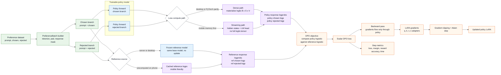

# DPO Training Flow

This diagram shows the MobileFineTuner DPO pipeline from preference data to
policy LoRA updates.

```mermaid
flowchart LR
    dataset["Preference dataset<br/>prompt, chosen, rejected"]
    batch["PreferenceBatch builder<br/>tokenize, pad, response mask"]
    chosen["Chosen branch<br/>prompt + chosen"]
    rejected["Rejected branch<br/>prompt + rejected"]

    dataset --> batch
    batch --> chosen
    batch --> rejected

    subgraph policy["Trainable policy model"]
        policyChosen["Policy forward<br/>chosen branch"]
        policyRejected["Policy forward<br/>rejected branch"]
    end

    chosen --> policyChosen
    rejected --> policyRejected

    mode{"Loss compute path"}
    policyChosen --> mode
    policyRejected --> mode

    dense["Dense path<br/>materialize logits B x S x V"]
    streaming["Streaming path<br/>hidden states + LM head<br/>no full logits tensor"]
    policyLogps["Policy response logprobs<br/>policy chosen logp<br/>policy rejected logp"]

    mode -->|desktop or PyTorch parity| dense
    mode -->|mobile memory first| streaming
    dense --> policyLogps
    streaming --> policyLogps

    refSource{"Reference source"}
    refModel["Frozen reference model<br/>same base model, no update"]
    cachedRef["Cached reference logps<br/>mobile friendly"]
    refLogps["Reference response logprobs<br/>ref chosen logp<br/>ref rejected logp"]

    chosen --> refSource
    rejected --> refSource
    refSource -->|server or desktop| refModel
    refSource -->|precomputed on phone| cachedRef
    refModel --> refLogps
    cachedRef --> refLogps

    dpo["DPO objective<br/>compare policy logratio<br/>against reference logratio"]
    loss["Scalar DPO loss"]
    backward["Backward pass<br/>gradients flow only through policy"]
    lora["LoRA gradients<br/>q, k, v, o adapters"]
    adam["Gradient clipping + Adam step"]
    updated["Updated policy LoRA"]
    metrics["Step metrics<br/>loss, margin, reward accuracy, time"]

    policyLogps --> dpo
    refLogps --> dpo
    dpo --> loss
    loss --> backward
    backward --> lora
    lora --> adam
    adam --> updated
    loss --> metrics

    classDef data fill:#E8F5E9,stroke:#2E7D32,stroke-width:1px,color:#111827;
    classDef model fill:#E3F2FD,stroke:#1565C0,stroke-width:1px,color:#111827;
    classDef path fill:#F3E8FF,stroke:#7C3AED,stroke-width:1px,color:#111827;
    classDef train fill:#FFF7ED,stroke:#EA580C,stroke-width:1px,color:#111827;
    classDef decision fill:#FFFFFF,stroke:#374151,stroke-width:1px,color:#111827;

    class dataset,batch,chosen,rejected data;
    class policyChosen,policyRejected,refModel model;
    class dense,streaming,policyLogps,refLogps,cachedRef path;
    class dpo,loss,backward,lora,adam,updated,metrics train;
    class mode,refSource decision;
```
